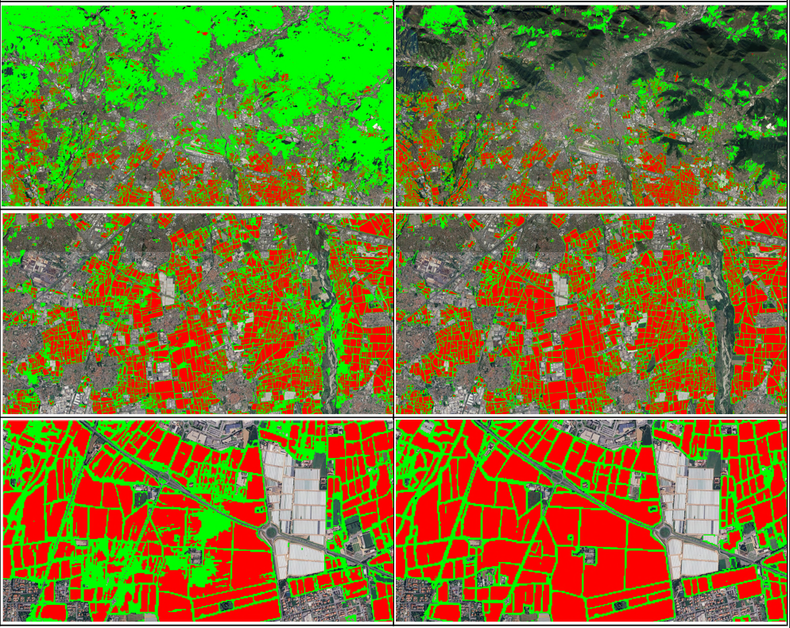
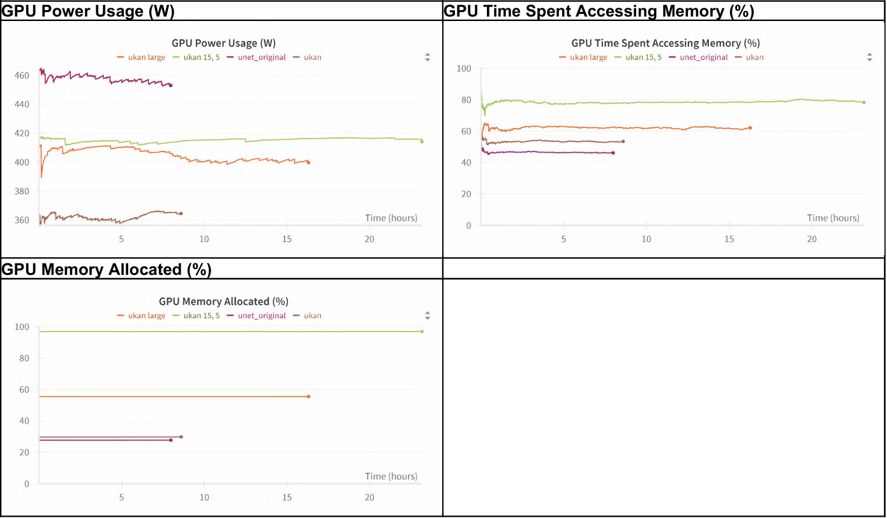

# UKAN-for-Earth-Observation
**The research is now completed and the manuscript is being submitted to the ISPRS Journal of Photogrammetry and Remote Sensing. \
Preprint will be available soon.**

---

## Authors
- [Cristian Andreoli](https://github.com/CristianAndreoli94/)  
  *MSc in Data Science, Department of Electronic and Information Engineering, University of Pavia*  

- [Leonardo Magliolo](https://github.com/MaglioloLeonardo)  
  *MSc in Artificial Intelligence, Department of Computer Science, University of Turin* \
  *PHD Student, Grounding the information flow for frugal AI, Télécom Paris*  

- [Fabio Dell'Acqua](http://tlclab.unipv.it/index.php/people/the-team?view=article&id=75&catid=23)  
  *Full Professor of Remote Sensing, Department of Electronic and Information Engineering, University of Pavia*  

---

### DUSAF Zero-Shot
Original FTW 3 class model on the left. Augmented 3 class model on the right.  

### Computational & Power Cost

